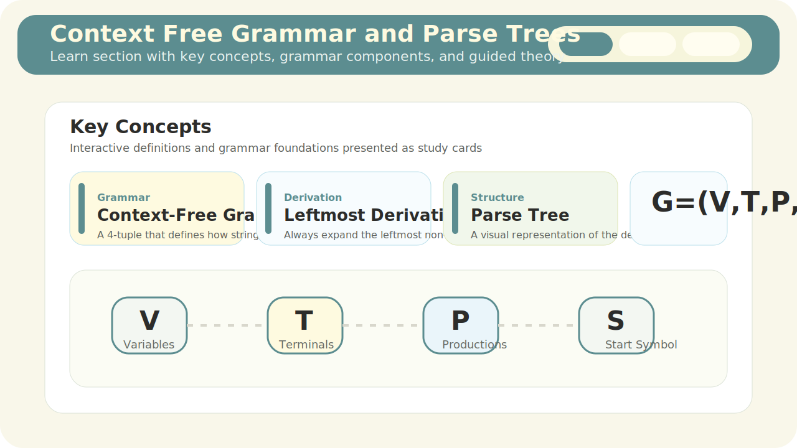
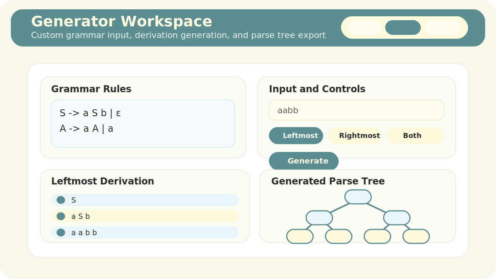
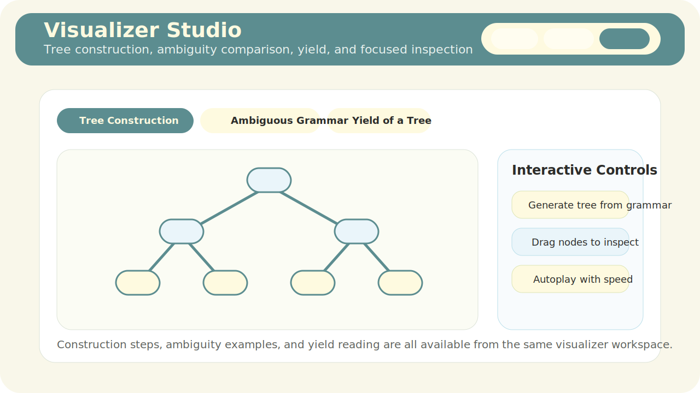
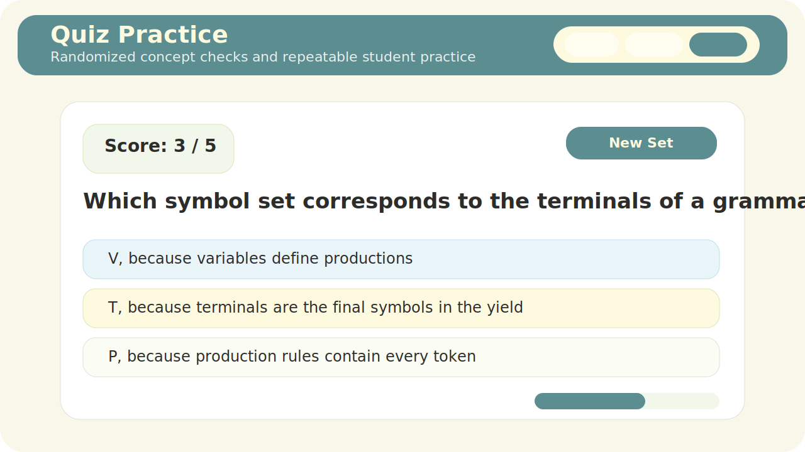

# Context Free Grammar and Parse Trees

Context Free Grammar and Parse Trees is an interactive teaching website for learning CFG fundamentals through derivations, parse trees, visual walkthroughs, and repeatable quiz practice. The project is deployed on Vercel and is designed for undergraduate students, instructors, and self-learners studying formal languages, automata, or compiler design.

## What The Website Covers

- concept learning for CFG terminology and core theory
- leftmost and rightmost derivation generation from custom grammar input
- parse tree generation and interactive node inspection
- visual tree construction and yield explanation
- ambiguity demonstration through multiple parse structures
- randomized quiz practice for repeated revision

## Live Project

This project is deployed through Vercel.

## Section Previews

### Learn

The Learn tab introduces CFG vocabulary, the grammar tuple `G = (V, T, P, S)`, derivation comparison, and parse-tree explanations in a visual format.



### Generator

The Generator tab lets users enter their own grammar and input string, generate leftmost or rightmost derivations, inspect step explanations, and export visual results as images.



### Visualizer

The Visualizer tab focuses on tree structure. It supports tree construction playback, ambiguity comparison, yield exploration, focused viewing, node dragging, and zooming.



### Quiz

The Quiz tab creates fresh question sets so learners can keep testing their understanding without being limited to a fixed static question list.



## Core Features

- custom grammar input using `->` and `|`
- support for `ε` as the empty string
- leftmost, rightmost, or dual derivation generation
- side-by-side derivation explanation panel
- autoplay controls for derivation steps and tree construction
- interactive parse trees with draggable nodes
- hover explanations for parse-tree nodes
- image export for derivation views and parse trees
- grammar input directly inside the visualizer
- randomized quiz practice

## Grammar Input Format

The grammar input is written in a classroom-friendly style:

```text
S -> a S b | ε
```

Example:

```text
E -> E + T | T
T -> T * F | F
F -> ( E ) | id
```

Guidelines:

- write one production per line
- use `->` between the left-hand side and right-hand side
- use `|` for alternatives
- use `ε` for the empty string
- spaces are optional for many single-character token inputs

## Project Structure

- [src/pages/Index.tsx](/D:/cfg-explorer/src/pages/Index.tsx:1): top-level tab routing and shared generator state
- [src/pages/LearnPageFixed.tsx](/D:/cfg-explorer/src/pages/LearnPageFixed.tsx:1): Learn page content and theory sections
- [src/pages/GeneratorPageEnhanced.tsx](/D:/cfg-explorer/src/pages/GeneratorPageEnhanced.tsx:1): grammar input, derivations, explanations, and parse tree generation
- [src/pages/VisualizerPageEnhanced.tsx](/D:/cfg-explorer/src/pages/VisualizerPageEnhanced.tsx:1): tree construction, ambiguity, yield, and visualizer-side grammar input
- [src/pages/QuizPage.tsx](/D:/cfg-explorer/src/pages/QuizPage.tsx:1): randomized quiz generation and feedback flow
- [src/pages/HelpPageEnhanced.tsx](/D:/cfg-explorer/src/pages/HelpPageEnhanced.tsx:1): concise usage and theory help
- [src/lib/cfg-engine-fixed.ts](/D:/cfg-explorer/src/lib/cfg-engine-fixed.ts:1): CFG parsing, derivation logic, and parse-tree construction
- [src/components/ParseTreeSVGFixed.tsx](/D:/cfg-explorer/src/components/ParseTreeSVGFixed.tsx:1): interactive tree rendering
- [src/lib/export-utils.ts](/D:/cfg-explorer/src/lib/export-utils.ts:1): image export helpers

## Tech Stack

- React
- TypeScript
- Vite
- Tailwind CSS
- Framer Motion
- Vitest

## Run Locally

```bash
npm install
npm run dev
```

## Build And Test

```bash
npm run build
npm test
```
