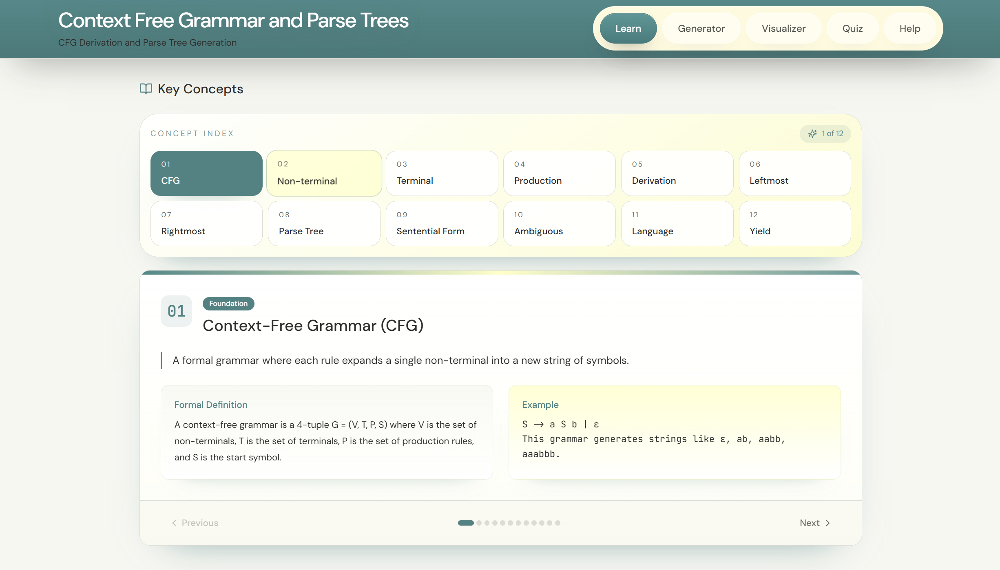
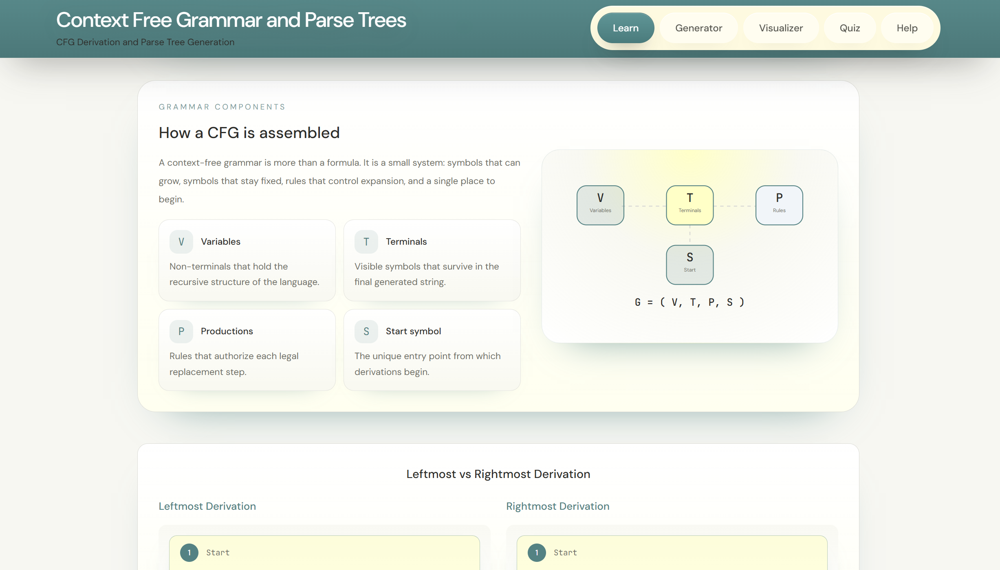
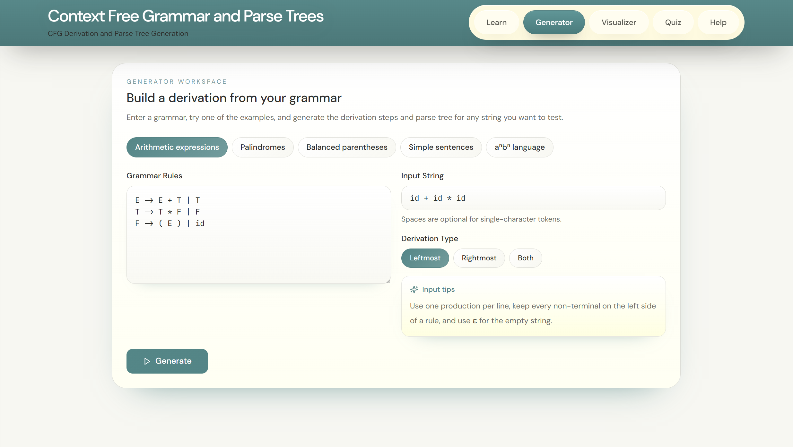
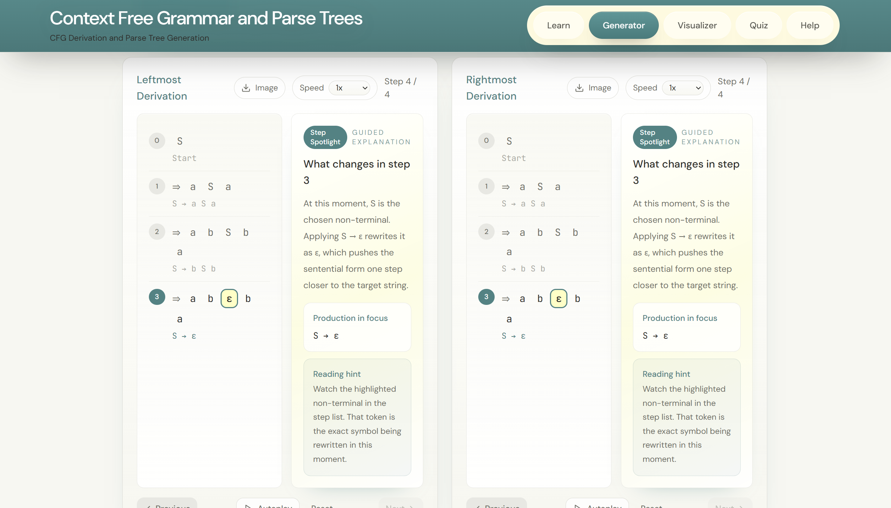
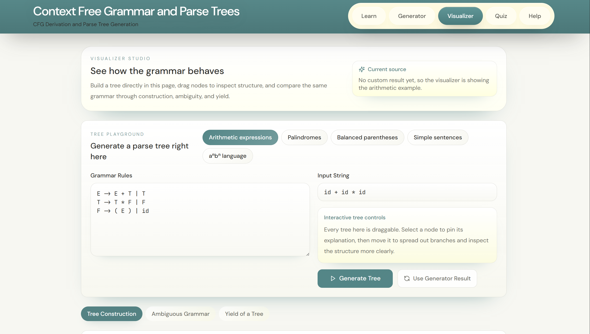
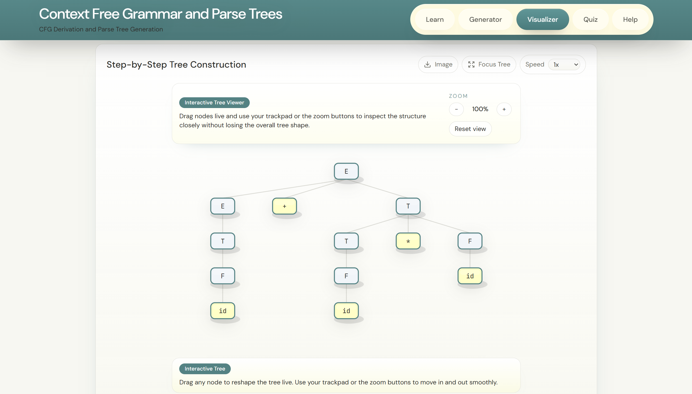
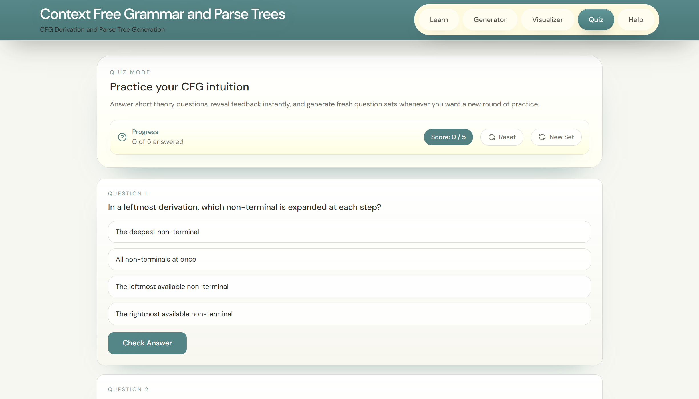
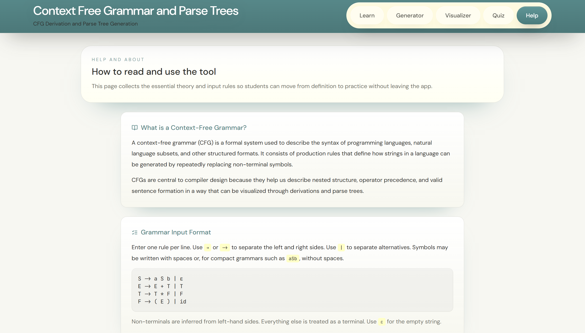

# Context Free Grammar and Parse Trees

Context Free Grammar and Parse Trees is an interactive educational website for learning context-free grammars through guided theory, derivation generation, parse tree visualization, and repeatable quiz practice. It is aimed at undergraduate students, instructors, and self-learners studying formal languages, automata, and compiler design.

The project is deployed on Vercel and built as a frontend-only React application.

## What The Website Covers

- CFG concepts such as terminals, non-terminals, productions, derivations, ambiguity, yield, and sentential forms
- leftmost and rightmost derivation generation from custom grammar input
- parse tree generation with interactive node inspection
- step-by-step tree construction and yield explanation
- ambiguity demonstration through alternate parse structures
- quiz-based practice with changing question sets

## Live Project

This project is deployed through Vercel.

## Video Walkthrough

A short screen recording of the website is included in the repository:

[Watch the project walkthrough video](docs/readme/media/cfg-demo-walkthrough.mp4)

## Website Screenshots

### Learn Page

The Learn page introduces CFG vocabulary, visual concept cards, grammar components, and derivation theory before users begin generating strings.

#### Key Concepts



#### Grammar Components and Derivation Theory



### Generator Page

The Generator page lets users enter grammar rules, choose an input string, and generate derivations and parse trees from their own input.

#### Generator Workspace



#### Leftmost and Rightmost Derivation View



### Visualizer Page

The Visualizer page is built for tree-focused exploration, including direct tree generation, construction playback, and interactive tree viewing.

#### Visualizer Input Area



#### Step-by-Step Tree Construction



### Quiz Page

The Quiz page gives students changing question sets so they can keep practising without repeating a fixed static sheet.



### Help Page

The Help page provides a concise explanation of the grammar format, the tool workflow, and supporting theory.



## Core Features

- custom grammar input using `->` and `|`
- support for `ε` as the empty string
- leftmost, rightmost, or dual derivation generation
- side-by-side derivation explanation panels
- autoplay controls for derivation steps and tree construction
- interactive parse trees with draggable nodes
- hover explanations for parse tree nodes
- image export for derivation views and parse trees
- grammar input directly inside the visualizer
- randomized quiz practice

## Grammar Input Format

The grammar input uses a classroom-friendly style:

```text
S -> a S b | ε
```

Example:

```text
E -> E + T | T
T -> T * F | F
F -> ( E ) | id
```

Guidelines:

- write one production per line
- use `->` between the left-hand side and right-hand side
- use `|` for alternatives
- use `ε` for the empty string
- spaces are optional for many single-character token inputs

## Directory Structure

```text
cfg-explorer/
|-- public/                            # Static public assets used by the deployed site
|   |-- og-preview.svg                 # Social sharing preview image
|   `-- robots.txt                     # Search crawler instructions
|
|-- docs/                              # Repository documentation assets
|   `-- readme/
|       `-- screenshots/               # Screenshots displayed in README.md
|
|-- src/                               # Main application source code
|   |-- components/                    # Shared React components
|   |   |-- ui/                        # Reusable shadcn/ui primitives
|   |   |-- Header.tsx                 # Top header and tab navigation
|   |   |-- NavLink.tsx                # Navigation link helper
|   |   |-- ParseTreeSVG.tsx           # Earlier parse tree renderer
|   |   `-- ParseTreeSVGFixed.tsx      # Final interactive parse tree renderer
|   |
|   |-- hooks/                         # Shared React hooks
|   |   |-- use-mobile.tsx             # Mobile breakpoint helper
|   |   `-- use-toast.ts               # Toast state helper
|   |
|   |-- lib/                           # Core grammar logic and utilities
|   |   |-- cfg-engine.ts              # Earlier CFG engine iteration
|   |   |-- cfg-engine-fixed.ts        # Final CFG parsing and derivation engine
|   |   |-- export-utils.ts            # Image export helpers
|   |   `-- utils.ts                   # Shared utility helpers
|   |
|   |-- pages/                         # Main page-level views
|   |   |-- Index.tsx                  # App shell and tab routing
|   |   |-- LearnPageFixed.tsx         # Final Learn page
|   |   |-- GeneratorPageEnhanced.tsx  # Final Generator page
|   |   |-- VisualizerPageEnhanced.tsx # Final Visualizer page
|   |   |-- QuizPage.tsx               # Quiz page
|   |   |-- HelpPageEnhanced.tsx       # Final Help page
|   |   `-- *.tsx                      # Earlier iteration page files kept from development
|   |
|   |-- test/                          # Automated tests and setup
|   |   |-- cfg-engine-fixed.test.ts   # CFG engine regression tests
|   |   |-- example.test.ts            # Example baseline test
|   |   `-- setup.ts                   # Vitest setup file
|   |
|   |-- App.tsx                        # Top-level React app wrapper
|   |-- App.css                        # Component-level styles
|   |-- index.css                      # Global styles, tokens, and animations
|   |-- main.tsx                       # React entry point
|   `-- vite-env.d.ts                  # Vite type declarations
|
|-- .gitignore                         # Git ignore rules
|-- components.json                    # shadcn/ui component config
|-- eslint.config.js                   # ESLint rules
|-- index.html                         # HTML entry and metadata
|-- package.json                       # Project manifest and scripts
|-- package-lock.json                  # Locked npm dependency tree
|-- postcss.config.js                  # PostCSS configuration
|-- tailwind.config.ts                 # Tailwind theme configuration
|-- tsconfig.json                      # Shared TypeScript config
|-- tsconfig.app.json                  # Frontend TypeScript config
|-- tsconfig.node.json                 # Tooling TypeScript config
|-- vite.config.ts                     # Vite configuration
|-- vitest.config.ts                   # Vitest configuration
`-- README.md                          # Project documentation
```

## Repository Structure And File Purpose

### Root Files

- [`package.json`](package.json): project metadata, npm scripts, and dependency definitions
- [`package-lock.json`](package-lock.json): npm lockfile for reproducible installs
- [`index.html`](index.html): Vite HTML entry file, browser metadata, favicon, and social preview metadata
- [`.gitignore`](.gitignore): ignored files and folders
- [`vite.config.ts`](vite.config.ts): Vite configuration, dev server settings, and path alias setup
- [`tailwind.config.ts`](tailwind.config.ts): Tailwind theme configuration and custom palette tokens
- [`postcss.config.js`](postcss.config.js): PostCSS configuration for Tailwind and Autoprefixer
- [`eslint.config.js`](eslint.config.js): linting setup for the codebase
- [`tsconfig.json`](tsconfig.json): shared TypeScript configuration
- [`tsconfig.app.json`](tsconfig.app.json): TypeScript settings for the frontend source files
- [`tsconfig.node.json`](tsconfig.node.json): TypeScript settings for tooling and config files
- [`vitest.config.ts`](vitest.config.ts): Vitest configuration
- [`components.json`](components.json): shadcn/ui configuration and aliases
- [`README.md`](README.md): project documentation

### Public Assets

- [`public/og-preview.svg`](public/og-preview.svg): Open Graph and Twitter preview image for sharing the project
- [`public/robots.txt`](public/robots.txt): crawler instructions for the deployed site

### Documentation Assets

- [`docs/readme/screenshots`](docs/readme/screenshots): screenshots used inside the GitHub README

### Source Entry And Global Styling

- [`src/main.tsx`](src/main.tsx): React entry point that mounts the application
- [`src/App.tsx`](src/App.tsx): top-level app wrapper
- [`src/index.css`](src/index.css): global styling, theme tokens, animation definitions, and shared visual classes

### Main Pages

- [`src/pages/Index.tsx`](src/pages/Index.tsx): main page router and shared generator state
- [`src/pages/LearnPageFixed.tsx`](src/pages/LearnPageFixed.tsx): final Learn page implementation
- [`src/pages/GeneratorPageEnhanced.tsx`](src/pages/GeneratorPageEnhanced.tsx): final Generator page implementation
- [`src/pages/VisualizerPageEnhanced.tsx`](src/pages/VisualizerPageEnhanced.tsx): final Visualizer page implementation
- [`src/pages/QuizPage.tsx`](src/pages/QuizPage.tsx): quiz generation, scoring, and feedback
- [`src/pages/HelpPageEnhanced.tsx`](src/pages/HelpPageEnhanced.tsx): Help page content and usage instructions
- [`src/pages/NotFound.tsx`](src/pages/NotFound.tsx): fallback route page

### Components

- [`src/components/Header.tsx`](src/components/Header.tsx): top header and tab navigation
- [`src/components/ParseTreeSVGFixed.tsx`](src/components/ParseTreeSVGFixed.tsx): interactive parse tree renderer with dragging, zoom, and hover information
- [`src/components/ui`](src/components/ui): reusable UI primitives used across the interface

### Core Logic

- [`src/lib/cfg-engine-fixed.ts`](src/lib/cfg-engine-fixed.ts): grammar parsing, derivation generation, parse tree creation, examples, and utility logic for CFG behaviour
- [`src/lib/export-utils.ts`](src/lib/export-utils.ts): helpers for exporting derivation and parse tree views as images
- [`src/lib/utils.ts`](src/lib/utils.ts): shared utility helpers

### Tests

- [`src/test/cfg-engine-fixed.test.ts`](src/test/cfg-engine-fixed.test.ts): tests for grammar parsing and derivation behaviour
- [`src/test/example.test.ts`](src/test/example.test.ts): simple example test scaffold
- [`src/test/setup.ts`](src/test/setup.ts): shared Vitest setup

### Earlier Iteration Files

These files were created during earlier development passes and are not the primary files currently wired into the final app flow:

- `src/pages/GeneratorPage.tsx`
- `src/pages/GeneratorPageFixed.tsx`
- `src/pages/VisualizerPage.tsx`
- `src/pages/VisualizerPageFixed.tsx`
- `src/pages/LearnPage.tsx`
- `src/pages/HelpPage.tsx`
- `src/components/ParseTreeSVG.tsx`
- `src/lib/cfg-engine.ts`

## Tech Stack

- React
- TypeScript
- Vite
- Tailwind CSS
- Framer Motion
- Vitest

## Run Locally

```bash
npm install
npm run dev
```

## Build And Test

```bash
npm run build
npm test
```
